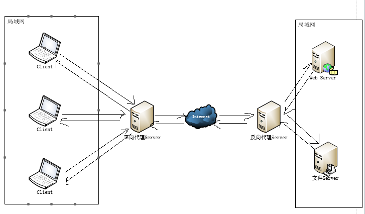

# nginx简易教程

## 概述

### 什么是nginx?
Nginx (engine x) 是一款轻量级的Web 服务器 、反向代理服务器及电子邮件（IMAP/POP3）代理服务器。

什么是反向代理？

反向代理（Reverse Proxy）方式是指以代理服务器来接受internet上的连接请求，然后将请求转发给内部网络上的服务器，并将从服务器上得到的结果返回给internet上请求连接的客户端，此时代理服务器对外就表现为一个反向代理服务器。



## 安装与使用

### 安装

发布版本分为 Linux 和 windows 版本。

也可以下载源码，编译后运行。

#### 从源代码编译 Nginx

把源码解压缩之后，在终端里运行如下命令：

```
brew install nginx
```

默认情况下，Nginx 会被安装在 /usr/local/nginx。通过设定编译选项，你可以改变这个设定。

#### Windows 安装

为了安装 Nginx / Win32，需先下载它。然后解压之，然后运行即可。下面以 C 盘根目录为例说明下：

```
cd C:
cd C:\nginx-0.8.54   start nginx
```

Nginx / Win32 是运行在一个控制台程序，而非 windows 服务方式的。服务器方式目前还是开发尝试中。

### 使用

nginx 的使用比较简单，就是几条命令。

常用到的命令如下:
```
nginx -s stop       快速关闭Nginx，可能不保存相关信息，并迅速终止web服务。
nginx -s quit       平稳关闭Nginx，保存相关信息，有安排的结束web服务。
nginx -s reload     因改变了Nginx相关配置，需要重新加载配置而重载。
nginx -s reopen     重新打开日志文件。
nginx -c filename   为 Nginx 指定一个配置文件，来代替缺省的。
nginx -t            不运行，而仅仅测试配置文件。nginx 将检查配置文件的语法的正确性，并尝试打开配置文件中所引用到的文件。
nginx -v            显示 nginx 的版本。
nginx -V            显示 nginx 的版本，编译器版本和配置参数。
```

如果不想每次都敲命令，可以在nginx安装目录下新添一个启动批处理文件startup.bat，双击即可运行。内容如下：

```
@echo off
rem 如果启动前已经启动nginx并记录下pid文件，会kill指定进程
nginx.exe -s stop

rem 测试配置文件语法正确性
nginx.exe -t -c conf/nginx.conf

rem 显示版本信息
nginx.exe -v

rem 按照指定配置去启动nginx
nginx.exe -c conf/nginx.conf
```

如果是运行在 Linux 下，写一个 shell 脚本，大同小异。

## nginx 配置实战

我始终认为，各种开发工具的配置还是结合实战来讲述，会让人更易理解。

### http反向代理配置

我们先实现一个小目标：不考虑复杂的配置，仅仅是完成一个 http 反向代理。

nginx.conf 配置文件如下：
**注：conf / nginx.conf 是 nginx 的默认配置文件。你也可以使用 nginx -c 指定你的配置文件**
