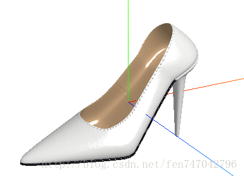
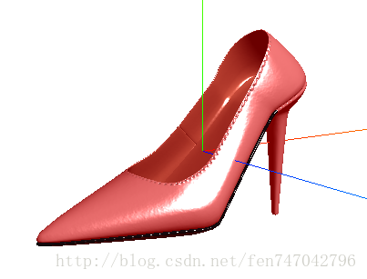
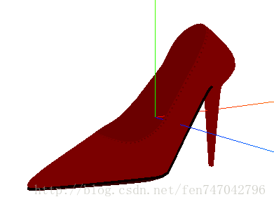
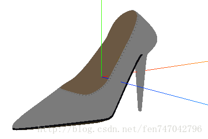

# 初识ThreeJS中常见的光源

现实环境中，人们之所以能看得到物体，是因为有光，物体的材质反射光到人眼中。在ThreeJS中有几种光源，去模拟现实环境。最常见的四种为：

- 环境光( AmbientLight )：笼罩在整个空间无处不在的光
- 点光源( PointLight )：向四面八方发射的单点光源
- 聚光灯( SpotLight )：发射出锥形状的光， 模拟手电筒，台灯等光源
- 平行光( DirectinalLight )：平行的一束光，模拟从很远处照射的太阳光

还有半球光光源( HemisphereLight )，平面光光源( AreaLight )，这里暂不做介绍。下面以一只高跟鞋为例来演示这几种光源。



图1 白色环境光 + 白色平行光的鞋子效果

P.S. 此处的坐标轴是为了辅助创建光源，更好地放置光源的位置。其中红色线表示X轴，绿色线表示Y轴，蓝色线表示Z轴，很好记，红绿蓝，RGB-XYZ。有时候为了搞错，可以用右手法则去验证一下。代码也非常简单。

```
var axis = new THREE.AxisHelper(3); // 3表示轴的长度
sscene.add(axis);
```

## 环境光(AmbientLight)

环境光可以说是场景的整体基调。如何创建环境光呢？代码如下。

```
var ambient = new THREE.AmbientLight(0xffffff);
scene.add(ambient); //将环境光添加到场景中
```

API也很简单，只有color和intensity参数。

```
AmbientLight( color, intensity )

color — 光的颜色值，十六进制，默认值为0xffffff.
intensity — 光的强度，默认值为1.
```

图1示例中的环境光为白光。我们将颜色设置为红色，看看什么效果。结果是整只鞋子都变成了红色。



图2 红色环境光 + 白色平行光的鞋子效果

需要注意的是，由于环境光无处不在，也就是说它是没有方向的，当然不能产生阴影。而且，它也不能作为环境中唯一的光源。我们来看一下只有环境光的效果。



图3 仅有红色环境光的鞋子效果



图4 仅有白色环境光光的鞋子效果

显然，只有环境光的场景是不真实的。那环境光什么作用呢？据说是弱化阴影或者给场景添加一些颜色。

## 点光源
